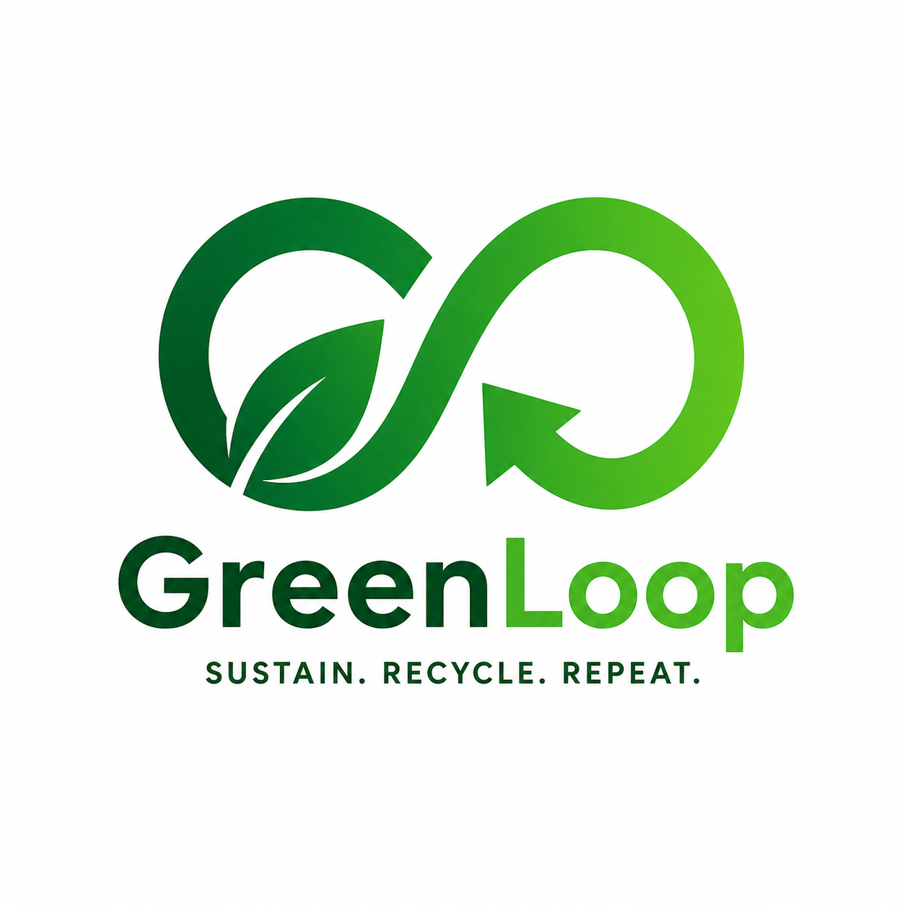
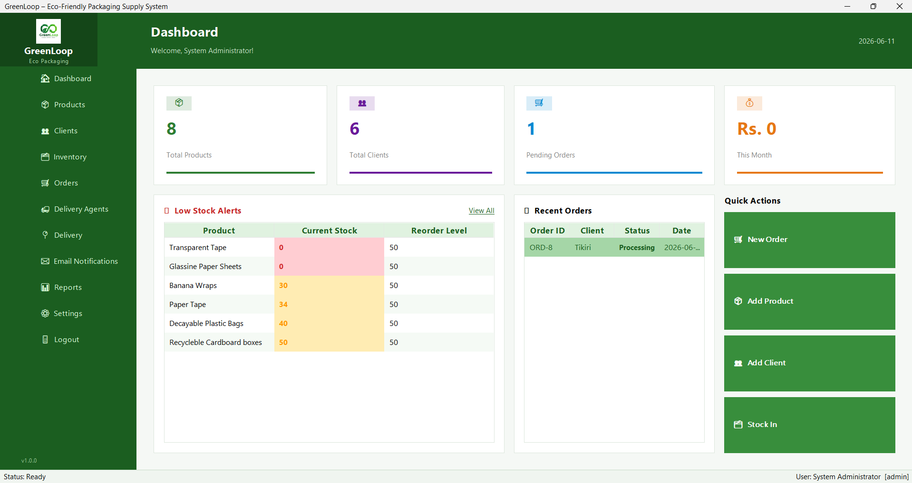
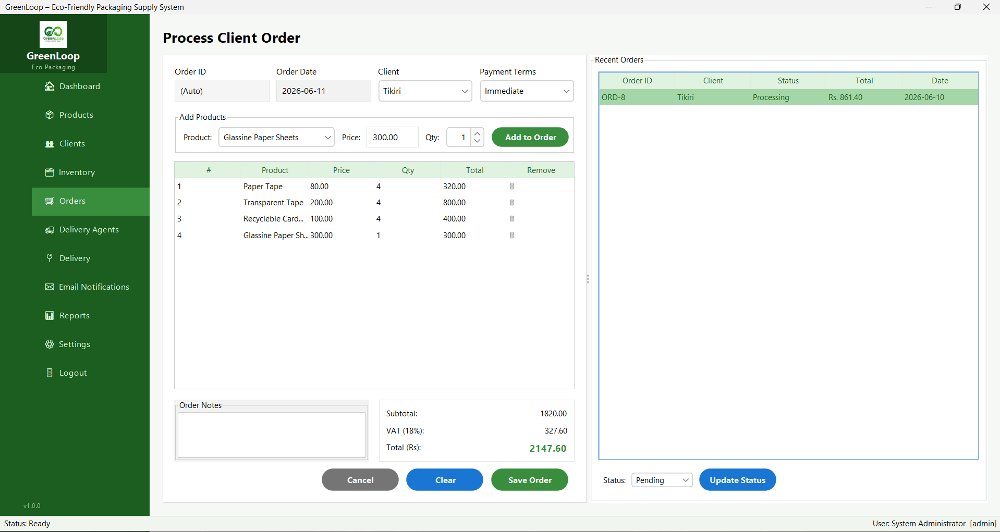
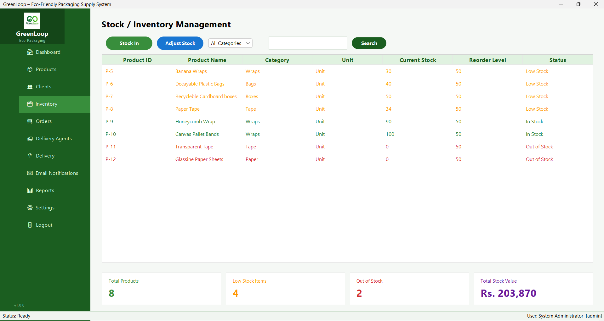
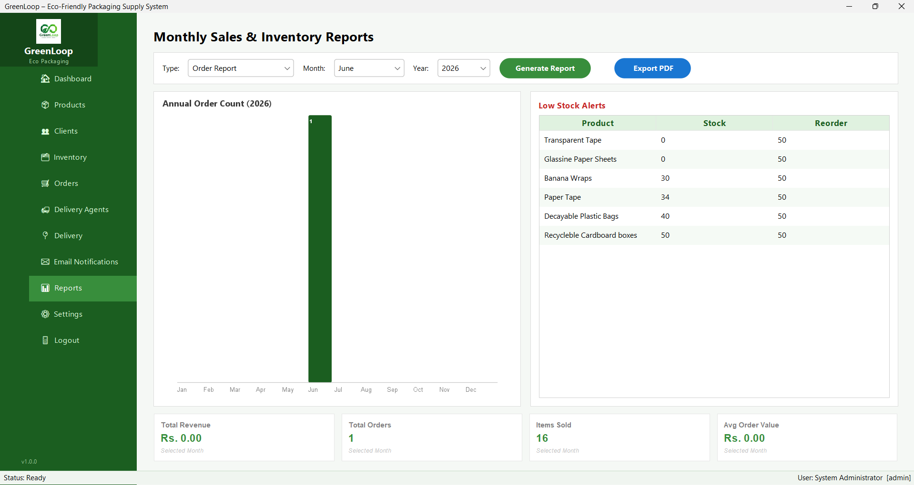
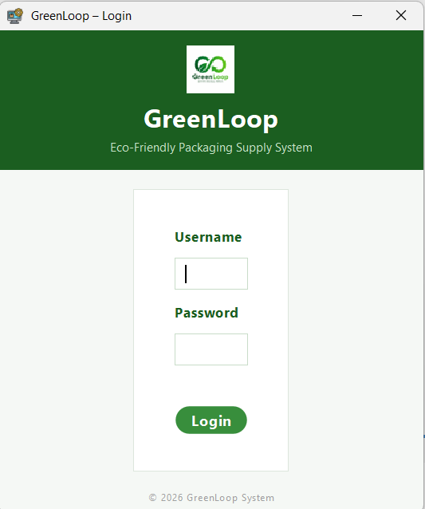
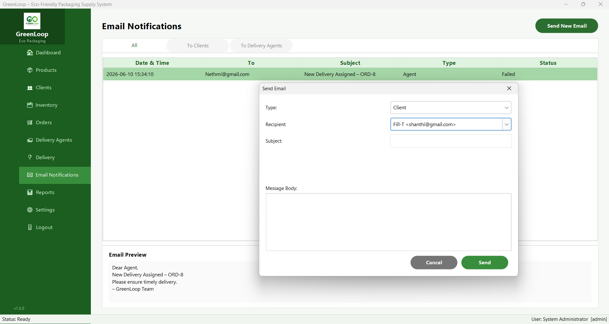

<div align="center">



# 🌿 GreenLoop
### Eco-Friendly Packaging Supply Management System

[](https://www.java.com)
[](https://www.mysql.com)
[](https://www.formdev.com/flatlaf/)
[](LICENSE)
[]()

> A full-featured desktop business management system for eco-friendly packaging suppliers — built with Java Swing following MVC architecture.

[Features](#-features) • [Screenshots](#-screenshots) • [Setup](#-getting-started) • [Architecture](#-architecture) • [Tech Stack](#-tech-stack)

---

</div>

## 📌 About The Project

**GreenLoop** is a desktop ERP-style application designed for businesses that supply eco-friendly packaging products. It covers the complete business workflow — from managing products and clients, processing orders with real-time stock deduction, assigning deliveries, sending email notifications, and generating monthly PDF reports.

Built as a **group software engineering project**, GreenLoop demonstrates clean MVC design, database transaction management, role-based access control, and professional Java Swing UI using the FlatLaf modern look and feel.

---

## ✨ Features

### 🔐 Authentication & Role-Based Access
- SHA-256 password hashing — passwords never stored in plain text
- Two roles: **Admin** (full access) and **Employee** (limited access)
- Dynamic sidebar that changes per role on login

### 📦 Product Management
- Add, edit, delete eco-friendly packaging products
- Eco rating per product (environmental friendliness score)
- Search and filter by name or category

### 👥 Client Management
- Manage business clients with contact details
- Active / Inactive status tracking
- Keyword search across all client fields

### 🗂️ Inventory Management
- Real-time stock levels with color-coded status (In Stock / Low Stock / Out of Stock)
- Stock In operation from supplier with full audit trail
- Manual stock adjustment with reorder level management

### 🛒 Order Processing
- Multi-item order creation with live total calculation
- **Atomic database transaction** — stock deducted and order saved in one operation, with full rollback on failure
- Order status lifecycle: Pending → Processing → Delivered / Cancelled

### 🚚 Delivery Management
- Assign orders to available delivery agents
- Full vehicle information tracking per agent
- Track and update delivery status in real time

### ✉️ Email Notifications
- Send order confirmations and alerts to clients via SMTP
- Full email history log with timestamps and success/failure status
- Configurable SMTP settings via `email.properties`

### 📊 Reports & Analytics
- Monthly KPI dashboard: Revenue, Orders, Items Sold, Average Order Value
- Annual revenue bar chart with month highlighting
- Low-stock alerts table
- **Export to PDF** using Apache PDFBox — includes chart, KPIs, and stock table
- Supports Sales Summary, Inventory Report, and Order Report types

### ⚙️ Settings
- Admin: manage user accounts, change passwords, configure DB connection
- Employee: view read-only profile

---

## 📸 Screenshots

| Dashboard | Orders |
|-----------|--------|
|  |  |

| Inventory | Reports |
|-----------|---------|
|  |  |

| Login | Email Notifications |
|-------|---------------------|
|  |  |


---

## 🏗️ Architecture

GreenLoop follows the **Model-View-Controller (MVC)** pattern strictly:

```
src/greenloop/
│
├── Main.java                  # Entry point — bootstraps FlatLaf and LoginFrame
│
├── model/                     # Data models (POJOs)
│   ├── GlUser.java            # System user (Admin / Employee)
│   ├── Client.java            # Business client
│   ├── Product.java           # Eco packaging product
│   ├── Stock.java             # Warehouse stock record
│   ├── Order.java             # Customer order header
│   ├── OrderItem.java         # Single line item within an order
│   ├── DeliveryAgent.java     # Delivery driver + vehicle info
│   └── EmailLog.java          # Email send history record
│
├── controller/                # Business logic + DB queries
│   ├── AuthController.java    # Login, logout, session (static)
│   ├── ClientController.java  # CRUD for clients
│   ├── ProductController.java # CRUD for products
│   ├── StockController.java   # Stock in, adjust, low-stock alerts
│   ├── OrderController.java   # Order placement with stock transaction
│   ├── DeliveryController.java# Assign + track deliveries
│   └── EmailController.java   # SMTP send + email log
│
├── view/                      # Swing UI panels
│   ├── LoginFrame.java        # Login window
│   ├── MainFrame.java         # App shell + sidebar navigation
│   ├── DashboardPanel.java    # KPI overview + recent activity
│   ├── ProductPanel.java      # Product management screen
│   ├── ClientPanel.java       # Client management screen
│   ├── InventoryPanel.java    # Stock management screen
│   ├── OrderPanel.java        # Order creation + management
│   ├── DeliveryAgentPanel.java# Delivery agent management
│   ├── DeliveryPanel.java     # Delivery assignment + tracking
│   ├── EmailNotificationPanel.java # Email sender + log viewer
│   ├── ReportsPanel.java      # Reports + PDF export
│   └── SettingsPanel.java     # User and system settings
│
├── database/
│   └── DBConnection.java      # Singleton MySQL connection with auto-reconnect
│
├── util/
│   └── UITheme.java           # Shared colors, fonts, and UI factory methods
│
└── resources/
    └── email.properties       # SMTP configuration (excluded from Git)
```

---

## 🛠️ Tech Stack

| Layer | Technology |
|-------|-----------|
| Language | Java 17+ |
| UI Framework | Java Swing + [FlatLaf 3.4.1](https://www.formdev.com/flatlaf/) |
| Database | MySQL 8.0 |
| DB Driver | MySQL Connector/J 9.7.0 |
| PDF Generation | Apache PDFBox 2.0.32 + FontBox 2.0.32 |
| Email | Jakarta Mail 2.0.1 + Jakarta Activation 2.0.1 |
| Logging | Apache Commons Logging 1.2 |
| Build Tool | Apache Ant (NetBeans project) |
| IDE | NetBeans |

---

## 🚀 Getting Started

### Prerequisites

- Java JDK 17 or higher
- MySQL Server 8.0
- NetBeans IDE (recommended) or any Java IDE

### Required JAR Libraries

Download these JARs and add them to your project's classpath:

| Library | Version | Download |
|---------|---------|---------|
| MySQL Connector/J | 9.7.0 | [maven.org](https://mvnrepository.com/artifact/com.mysql/mysql-connector-j) |
| FlatLaf | 3.4.1 | [formdev.com](https://www.formdev.com/flatlaf/) |
| PDFBox | 2.0.32 | [pdfbox.apache.org](https://pdfbox.apache.org/download.html) |
| FontBox | 2.0.32 | [pdfbox.apache.org](https://pdfbox.apache.org/download.html) |
| Jakarta Mail | 2.0.1 | [mvnrepository.com](https://mvnrepository.com/artifact/com.sun.mail/jakarta.mail) |
| Jakarta Activation | 2.0.1 | [mvnrepository.com](https://mvnrepository.com/artifact/com.sun.activation/jakarta.activation) |
| Commons Logging | 1.2 | [mvnrepository.com](https://mvnrepository.com/artifact/commons-logging/commons-logging) |

### 1. Clone the repository

```bash
git clone https://github.com/YOUR_USERNAME/greenloop.git
cd greenloop
```

### 2. Set up the database

```bash
mysql -u root -p < database/greenloop_schema.sql
```

### 3. Configure the database connection

Open `src/greenloop/database/DBConnection.java` and update:

```java
private static final String URL  = "jdbc:mysql://localhost:3306/greenloop";
private static final String USER = "your_mysql_username";
private static final String PASS = "your_mysql_password";
```

### 4. Configure email (optional)

Copy the template and fill in your SMTP credentials:

```bash
cp src/greenloop/resources/email.properties.example src/greenloop/resources/email.properties
```

Edit `email.properties`:
```properties
mail.smtp.host=smtp.gmail.com
mail.smtp.port=587
mail.smtp.username=your@email.com
mail.smtp.password=your_app_password
mail.from.address=your@email.com
mail.from.name=GreenLoop System
```

### 5. Add JARs to classpath

In NetBeans: right-click project → Properties → Libraries → Add JAR/Folder → add all downloaded JARs.

### 6. Run

```bash
# In NetBeans: press F6 or click Run
# Or from command line after building:
java -jar dist/Sony.jar
```

### Default login credentials

| Username | Password | Role |
|----------|----------|------|
| `admin` | `admin123` | Admin |
| `employee` | `emp123` | Employee |

> ⚠️ Change these immediately after first login via Settings.

---

## 🗄️ Database Schema

The database contains the following tables:

```
greenloop/
├── users          — System users (admin & employee accounts)
├── clients        — Business clients
├── products       — Eco-friendly packaging products
├── stock          — Warehouse stock levels per product
├── orders         — Order headers
├── order_items    — Order line items
├── delivery_agents— Delivery drivers and vehicle info
├── deliveries     — Order-to-agent assignments
├── email_logs     — Email send history
└── app_settings   — Key-value system configuration
```

See [`database/greenloop_schema.sql`](database/greenloop_schema.sql) for the full schema.

---

## 👥 Team

| Name | Role |
|------|---------------|
| **[Manushan Sandeepa]** | Group Leader |
| **[Movin Jayathilaka]** | Team member |
| **[Ashara Herath]** | Team member |
| **[Ashen Herath]** | Team member |

---

## 📄 License

This project is licensed under the MIT License — see the [LICENSE](LICENSE) file for details.


<div align="center">

Made with 💚 as part of a Software Engineering coursework project

⭐ Star this repo if you found it useful!

</div>
